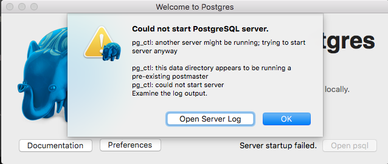

postgres
--------

## Error while initializing

This is the second time I get this error.
The commom factor was server closing wrongly when osx crashed.

> Could not start PostgreSQL server.
>
> pg_ctl: another server might be running; trying to start server anyway
>
> pg_ctl: this data directory appears to be running a pre-existing postmaster
> pg_ctl: could not start server
> Examine the log output.

log output:

> FATAL:  lock file "postmaster.pid" already exists
> HINT:  Is another postmaster (PID 414) running in data directory
> "/Users/snk/Library/Application Support/Postgres/var-9.4"?

### Solution:

delete the file `postmaster.pid`, remember of doing a backup first.

### Screenshot of Error

***
