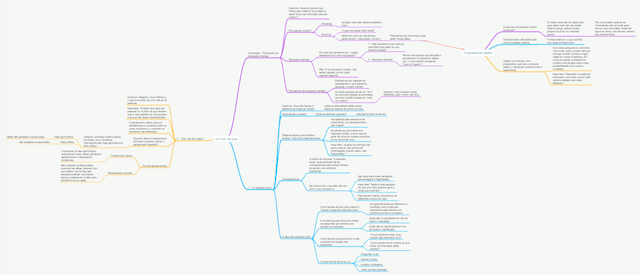
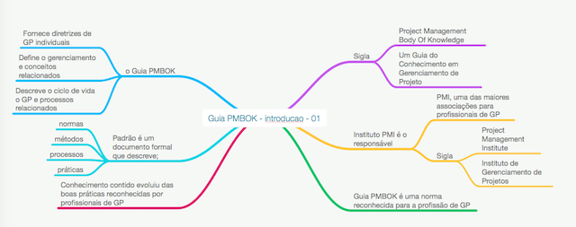
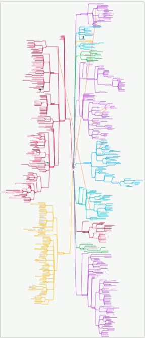
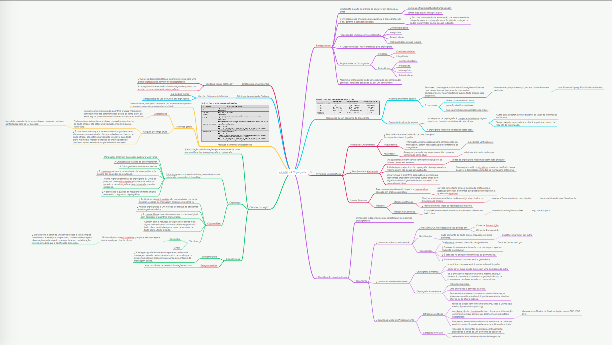
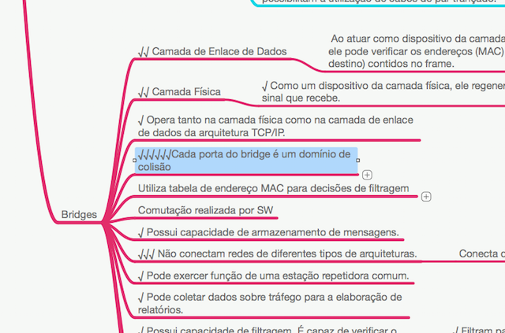

Mapas Mentais
-----

Eu uso mapa mental desde que o Gu comentou comigo, ainda na Universade.
Então nunca me preocupei muito com a teoria do porque e nem com o jeito que
alguns defendem como ser o certo para fazê-los, eu simplemente faço o melhor
que posso com o talento que eu tenho. ehehehe.

#### Por que fazer?

Alguns dos motivos que se defende para o uso e benefícios do mapa mental
seria;

1. O fato de ser uma ferramenta visual, podendo incorporar: cores, figuras,
palavras, números etc.

2. O mapa mental faz a ligação de um grupo de conceitos, ramificando-os de forma
natural.

3. Ele oferece uma visão global do conceito principal ao mesmo tempo que possui
um grande quantidade de informação.

1. Ser uma forma bem intuitiva de organizar as ideias, a forma de ligação de
permite que uma as ideias se ramifiquem em vez de ser uma ideia linear como
este texto.

1. Faz com que você sumarize a ideia, exercitando o poder de síntese e ligações
entre conceitos relacionados ou semelhantes.

**Como tudo na vida, os mapas possuem as pessoas que amam, e as que devem
odiar, nunca procurei essas pessoas, mas saiba que provavelmente estejam por
aí e devam ter seus argumentos.**

#### Quais elementos devem ter no Mapa Mental

Existem várias teorias de como um mapa mental deve ser feito, vou comentar
algumas só para dar uma visão geral.

1. Os mapas devem ser *pequenos*, ou seja, possuir poucas ramificações;

  * Evitar que a ideia central se perca.

  * Facilita a revisão do conteúdo, já que com um passar de olhos é possível
absorver toda a informação.

1. Usar sempre elementos visuais:

  * Imagens e fotos relacionados ao conceito que irão facilitar a memorização.

  * Cores, pois as cores estimulam o cérebro como as imagens fazem, usando as
nos conceitos principais envidenciando-os.

1. Utilizar abreviações, siglas e acrônimos para economizar tempo na escrita e
na revisão, e.g.: (HBC - Horas de Bunda na Cadeira, …).

1. Letras grandes, elas estimulam a leitura e não forçam a visão.

1. Ramificações, a ideia central deve ser ramificada em ideias secundárias, que
então devem ser ramificadas em ideias terciárias, e assim por diante.

1. Criar uma história mental por trás do mapa para facilitar a memorização.

1. Os mapas devem possuir um cabeçalho com as informações necessárias para
identificar: a matéria, assunto, data, o número (quando há uma ordem entre
mapas).

Essa lista não é exaustiva, deve existir inúmeras outras ideias que desconheço.

Um exemplo muito legal de mapa que tem uma história e que até hoje eu lembro
quando cai em prova é [explicando o uso dos "porquês"](https://lgcm.com.br/kit_files/snk_download/historia-porques.pdf).
Eu jamais teria paciência de fazer isso, mas tem doido para tudo.

Uma coisa importante é não ser perfeccionista, não queira fazer o melhor desenho,
encontrar a melhor imagem, utilizar todas as cores etc.
A praticidade e agilidade também é importante, com o tempo a prática faz o mapas
ficarem melhores com pouco esforço.

#### Como fazer; Mão vs Software

Tem quem defenda que os mapas devem ser feitos com lapis, papel, recortes e etc.

Por outro lado, existe inúmeros programas para fazer mapas mentais;

* Alguns possuem uma certa tendência em ser "visuais" com mais cores, formas
não geométricas para os elemtentos e ligações.

* Outros, por sua vez, são mais "minimalistas", com linhas suaves, menos
adapdados a receberem um toque artístico.

#### Como eu faço?

Eu não faço praticamente nada que falei lá em cima.

Em geral meus mapas são de médios para grandes, as vezes ficam gigantes e em
algum momento eu acabo divindo ele em vários outros menores.

Alguns mapas que eu fiz:

***

* Durante a faculdade eu li um [livro](http://www.saraiva.com.br/um-toc-na-cuca-313776.html)
e fiz um mapa resumindo a ideia do livro, tem bastante mapa desse tipo na internet.
[Mapa em PDF](https://lgcm.com.br/kit_files/snk_download/livro-um-toc-na-cuca.pdf)

***

* Já tentei fazer mapas pequenos, com poucas informações, mas dá muito trabalho
e achei que não valia o tempo que eu estava gastando sintetizando o conteúdo
[Mapa em PDF](https://lgcm.com.br/kit_files/snk_download/pmbok.pdf.pdf).

***

* Mapas que acaba fazendo ao mesmo tempo que assitia video aula e ficava gigante
por ser cursos longos [Mapa em PDF](d-adm-Lei8112-Servidor-Publico.pdf).

***

* Quando estudo usando livros, resumo tópicos, capítulos em um mapa, dependendo
do tamanho eu divido, [Mapa em PDF](https://lgcm.com.br/kit_files/snk_download/cript-01-ACriptografia.pdf).

***

* Outro uso que achei para os mapas, depois que estudei um assunto, faço
questões daquele assunto para avaliar o estudo, e conforme vou vendo questões
com conteúdo que não tem no mapa, eu adiciono, e utilizo o caracter de "check"
no início da frase indicando que já caiu.
E consigo saber o que já caiu mais de uma vez, e até muitas vezes.

***
